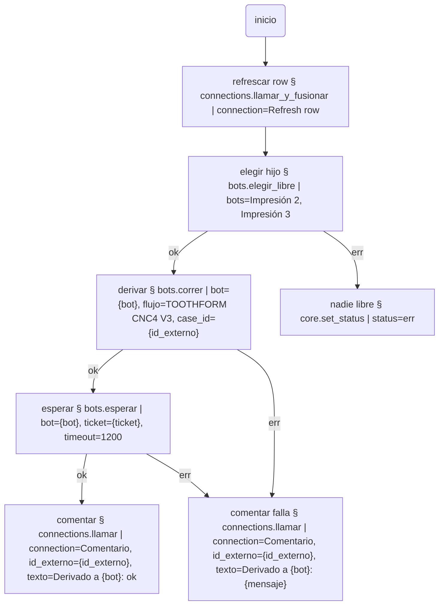

# bots — hablar con otros Bots desde un flujo

Cada Bot expone una API HTTP: la misma que usa su propio navegador. Este
plugin la aprovecha para que un flujo pregunte qué está haciendo otro Bot,
elija uno libre, le mande un caso y espere el resultado. Con eso se arma un
**Bot padre que reparte trabajo** entre hijos, o **Bots que se coordinan**
mirando lo que hizo el otro, todo escrito en Mermaid y sin código.

Es también la puerta para un **agente remoto**: un agente en otra PC (o en
la nube) que quiere validar qué flujos hay, disparar uno y mirar cómo fue,
usa exactamente los mismos endpoints que este plugin. Están listados abajo.

## Lo que ve quien opera

**Plug ins → Bots.** Una colección *Bots conocidos*: nombre, dirección y
nota. La dirección es la que muestra el ícono de la bandeja del otro Bot en
"Copiar dirección para otras PCs", por ejemplo `http://192.168.9.41:8000`.
Cada fila tiene **Probar**: "responde · 0 en vuelo · último run ok", o "no
responde en http://…", y **Abrir en pestaña**, que abre la pantalla de ese Bot
en el navegador. Un setting: cuántos segundos esperar antes de dar por caído
a un Bot (15 por defecto). El nombre que titula la pestaña de cada Bot no es
de este plugin: es la identidad de la instalación (`/api/core/identidad`).

### Lo que la app lee de este plugin

El plugin no dibuja la pantalla ni escribe en la base: deja los datos y la
app los usa sin conocer el plugin por nombre.

| Dónde | Qué | Para qué |
|---|---|---|
| outputs de la Action `abrir` | `abrir_url`: `http://ip:puerto/?bot=<nombre>` | la app hace `window.open(abrir_url, "_blank")` en vez de mostrar el modal |
| outputs de la Action `probar` | `indicador`: `{"estado": "ok"\|"err", "texto": …}` (en el ok **y** en el err) | la app lo guarda por fila (en una tabla propia de la webapp) y dibuja el check verde (o lo apaga) sin volver a apretar Probar |
| query `?bot=` de la URL abierta | el nombre con que el otro Bot lo conoce | título de la pestaña si ese Bot todavía no tiene nombre en `/api/core/identidad` |

**Workflows.** Categoría **BOTS** en el selector de tool. Los nodos nombran
al Bot por su nombre, nunca por URL:

| Paso | Qué hace | Deja |
|---|---|---|
| `bots.estado \| bot=Impresión 2` | cuántos runs tiene en vuelo, si está libre, cómo terminó el último | `{corriendo}`, `{libre}` (`si`/`no`), `{ultimo_estado}`, `{ultimo_flujo}`, `{ultimo_caso}`, `{en_vuelo}` |
| `bots.elegir_libre \| bots=Impresión 2, Impresión 3` | el que menos tiene en vuelo; saltea a los que no responden | `{bot}`, `{corriendo}`, `{caidos}` |
| `bots.correr \| bot={bot}, flujo=TOOTHFORM CNC4 V3, case_id={id_externo}` | le pide al otro que corra **su** flujo sobre el caso, sin esperar | `{ticket}`, `{bot}` |
| `bots.esperar \| bot={bot}, ticket={ticket}, timeout=900, cada=5` | espera a que termine, anotando en el log en qué paso va el hijo | `{estado_hijo}`, `{run_id}`, `{mensaje}`, `{hijo}` |

`bots.correr` vuelve en el acto. El que aguarda es `bots.esperar`, y es `ok`
si el hijo terminó `ok`, `err` si terminó `err`, si el ticket no existe o si
venció el `timeout` (el hijo sigue corriendo allá: no se lo cancela). Así un
padre puede mandar a tres hijos primero y esperar a los tres después.

La fila que recibe el hijo es el param `row` si se da, o `{id_externo:
case_id}` si no: lo que un flujo que arranca por "refrescar row" necesita.

## Un padre que deriva



En la grilla del padre, la columna Log de esa fila muestra la barra mientras
`bots.esperar` aguarda, y el log del run dice "Impresión 2: 3/10 · Exportar"
cada vez que el hijo cambia de paso. En la grilla del hijo, la fila aparece
como cualquier otra, con source `bot:<caso del padre>`.

## Bots colaborativos con la misma lista

Sondear "qué está haciendo o qué hizo el otro" alcanza para **repartir**
(un padre, varios hijos) y para **no pisarse en lo obvio** (no mandarle a
un Bot que ya tiene tres en vuelo). No alcanza para que dos Bots miren la
misma lista y tomen casos distintos: los dos ven el mismo caso libre en el
mismo instante y los dos lo toman.

Para eso hace falta un **reclamo atómico en la fuente de datos**: un campo
`asignado_a` que se escribe una sola vez, con un endpoint que reclame y
devuelva si ganó. En un flujo colaborativo el primer paso es ese reclamo
(una Action de `connections` contra la fuente); si no ganó, pasa al
siguiente caso. Ahí el intermediario tiene sentido, pero como dato, no como
canal: los Bots siguen hablándose directo por HTTP.

## Para un agente remoto: la API que usa este plugin

Todo bajo `http://<ip>:<puerto>/api/core`. El Bot tiene que correr con
`--red` (es lo que hace el acceso directo "Abrir Bot"). No hay
autenticación: es la red local; para exponerlo afuera hace falta un proxy
que la ponga.

| Método y ruta | Qué hace |
|---|---|
| `GET /overview` | resumen de la instalación |
| `GET /workflows` · `GET /workflows/<nombre>` · `PUT /workflows/<nombre>` | los flujos: listar, leer con contenido, crear o cambiar (devuelve diagnósticos) |
| `POST /validate` `{flow, case_id, row}` | dry run: recorre sin ejecutar nada |
| `POST /run` `{flow, case_id, row, source, actor}` | correr y **esperar** el resultado (bloquea) |
| `POST /runs` (mismo cuerpo) | correr **sin esperar**: devuelve `{ticket}` |
| `GET /runs/ticket/<ticket>` | `en_cola` · `en_vuelo` (con `vivo.hechos/total/paso`) · `terminado` (con `run`) · `desconocido` |
| `GET /runs/en-vuelo` | lo que corre ahora |
| `GET /runs?limit=&case_id=&source=` · `GET /runs/<run_id>` | historial, y la traza completa de un run |
| `GET /tools` · `GET /plugins` | qué tools y plugins hay |
| `GET /plugins/catalog` · `POST /plugins/catalog/install` `{name}` | plugins en línea |
| `GET /env` · `PUT /env/<NOMBRE>` `{value, secret}` | variables y secretos (los secretos no se leen) |

Un agente que quiere "validar los workflows que hay" hace `GET /workflows`,
`GET /workflows/<x>` para leer cada uno, `POST /validate` para el dry run, y
`POST /runs` + `GET /runs/ticket/<t>` para correr uno y mirar cómo fue. Es
lo mismo que ofrece el MCP local (`webapp.mcp_servidor`), por HTTP.

Si además quiere que un Source del padre muestre lo que hizo el hijo,
alcanza con apuntar un Source HTTP a `http://<hijo>/api/core/runs` con campo
clave `run_id`: la grilla del padre lista las corridas del hijo y puede
correr flujos del padre sobre ellas.

## Tests

```bash
python -m pytest bots          # necesita el núcleo: ../workflow-bot-app o WORKFLOW_BOT_APP
```
