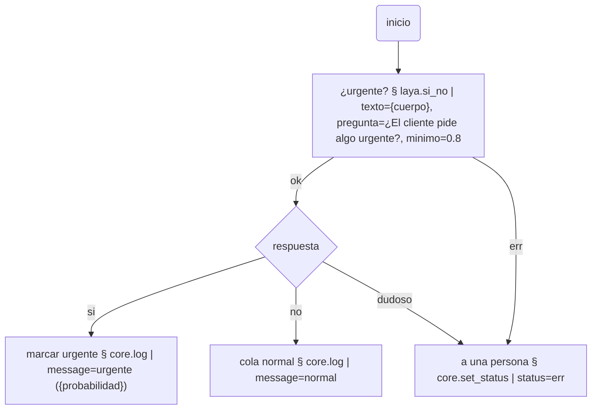
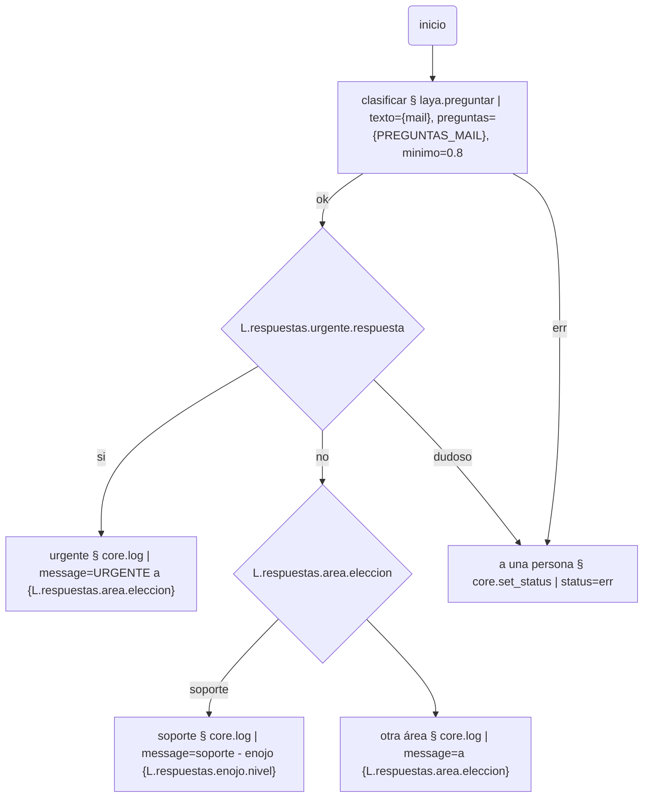

# laya

Preguntarle a [Laya](https://huggingface.co/convaiinnovations/laya) cosas
tipadas sobre un texto o una fila, desde un flujo: sí o no, elegir una
opción, ubicar en una escala. Laya no es un LLM: es un clasificador (tipo
BERT, Apache 2.0) que contesta en una sola pasada, en milisegundos, con la
probabilidad de cada respuesta. Sirve para clasificar un mail, decidir si un
caso es urgente o elegir a qué cola va, sin mandar datos afuera.

## Qué se instala y qué no

El plugin se instala solo desde Plug ins → *Plugins en línea*, como cualquier
otro, y **no trae dependencias**: no tiene `requirements.txt`, sólo pide el
port `http`. No es como un plugin que declara numpy o trimesh para que la app
los instale con pip.

Lo que **no** se instala solo es `laya-serve`, el servidor con el modelo. Eso
se instala a mano, una vez, en la PC que lo va a correr. Va aparte a
propósito: son torch (cientos de MB, más con CUDA) y ~1,5 GB de pesos que se
bajan de Hugging Face la primera vez. Como `requirements.txt` harían enorme la
instalación de cada Bot, y los pesos se bajarían por fuera de los ports.

## El servidor

El plugin no carga el modelo: le habla por el port `http` a `laya-serve`, el
servidor que trae el mismo paquete `laya`. Corre una vez, en la máquina que
tenga GPU (en CPU anda, más lento), y lo usan todos los Bots de la red.

```bash
pip install laya fastapi uvicorn
LAYA_PORT=8010 LAYA_MODELS=multilingual laya-serve
```

- `LAYA_PORT=8010`: el 8000 por defecto es el del Bot.
- `LAYA_MODELS=multilingual`: carga sólo el modelo que entiende castellano
  (~1,5 GB la primera vez, desde Hugging Face). Sin esto carga los tres.
- `LAYA_HOST=127.0.0.1` si sólo lo usa el Bot de esa misma PC; por defecto
  escucha en toda la red.
- `LAYA_API_KEY=<clave>` para pedir clave; la misma va en Config del plugin.

En Config → Plugins → Laya: la dirección (`http://127.0.0.1:8010` por
defecto, o la de la PC con GPU), la clave si hay, y el modelo (vacío: el
servidor elige por el idioma del texto).

## Tools

Categoría **LAYA**. Todos son `ok` si Laya contestó y `err` si no respondió o
la pregunta está mal armada. La respuesta va en un output, para ramificar con
un nodo de decisión: así "Laya dijo que no" y "Laya está apagado" no toman la
misma arista.

| Paso | Qué hace | Deja |
|---|---|---|
| `laya.si_no \| texto={mail}, pregunta=¿Pide algo urgente?, minimo=0.8` | sí o no | `{respuesta}` (`si`/`no`/`dudoso`), `{probabilidad}` de sí |
| `laya.elegir \| texto={mail}, pregunta=¿A qué área va?, opciones=ventas, soporte, admin` | una opción | `{eleccion}` (o `dudoso`), `{confianza}`, `{probabilidades}` |
| `laya.puntuar \| texto={mail}, pregunta=¿Qué tan enojado está?, niveles=nada, algo, mucho` | un nivel de una escala ordenada | `{nivel}` (o `dudoso`), `{indice}`, `{valor}` ponderado, `{confianza}` |
| `laya.preguntar \| texto={mail}, preguntas={PREGUNTAS_MAIL}, minimo=0.8` | varias preguntas en un solo request | `{respuestas}` (una entrada por pregunta), `{dudosas}` |
| `laya.disponible` | si el servidor está arriba | `{modelos}` cargados |

`texto` puede ser un texto o una `{variable}` con una fila: llega a Laya como
objeto. `opciones` acepta etiquetas separadas por coma o un JSON con una
descripción corta por opción (`{"ventas": "compra o presupuesto", ...}`), que
ayuda bastante.



## Varias preguntas en una pasada

`laya.preguntar` manda todas juntas y deja `{respuestas}`: un objeto con una
entrada por pregunta, con exactamente los outputs del tool suelto de su tipo.
Se leen con el camino anidado del núcleo (v0.3.1-beta.13 en adelante), también
desde un nodo de decisión: `{L.respuestas.urgente.respuesta}`,
`{L.respuestas.area.eleccion}`, `{L.respuestas.enojo.nivel}`. `{dudosas}` lista
los ids que salieron `dudoso`.

Las preguntas son un JSON. Escrito a mano adentro del nodo no sobrevive hoy a
que el editor vuelva a guardar el `.mmd` (las comillas del JSON chocan con las
del valor), así que van en una variable: en Config → Variables, o en una
columna de la fila.

```json
{
  "urgente": {"tipo": "si_no", "pregunta": "¿El cliente pide algo urgente?"},
  "area": {"tipo": "elegir", "pregunta": "¿A qué área va el pedido?",
           "opciones": {"ventas": "compra o presupuesto", "soporte": "algo no funciona", "admin": "facturas o pagos"}},
  "enojo": {"tipo": "puntuar", "pregunta": "¿Qué tan enojado está?", "niveles": "nada, algo, mucho", "minimo": 0.6}
}
```

Cada pregunta lleva `tipo` (`si_no`, `elegir`, `puntuar`), `pregunta`, lo que
pida su tipo (`opciones`, `niveles`, `umbral`) y, si quiere, su propio
`minimo`. El id va sin puntos ni espacios: es un tramo del camino.



## Cómo preguntarle para que acierte

Medido contra estados etiquetados a mano, no teoría:

- **Sí/no antes que elegir.** Una pregunta de sí/no por problema acertó 75%;
  una sola que elegía entre 7 opciones, 21% (se sesga a una). Un problema
  complejo conviene partirlo en varios `laya.si_no` y combinar en el flujo.
- **Datos planos y en palabras.** "stock bajo, bajando" funciona mejor que
  números sueltos o JSON anidado. No razona posiciones ni cuentas.
- **No mezclar hechos con anuncios** en el mismo texto ("hay sequía" vs
  "anuncian sequía"): se confunde.
- **Se equivoca con convicción.** A veces contesta contradicciones (que falta
  y sobra lo mismo), y se le escapan las paráfrasis indirectas. `minimo`
  ataja las respuestas al azar, no las equivocadas: una decisión que cuesta
  plata necesita además un control en el flujo o una persona.
