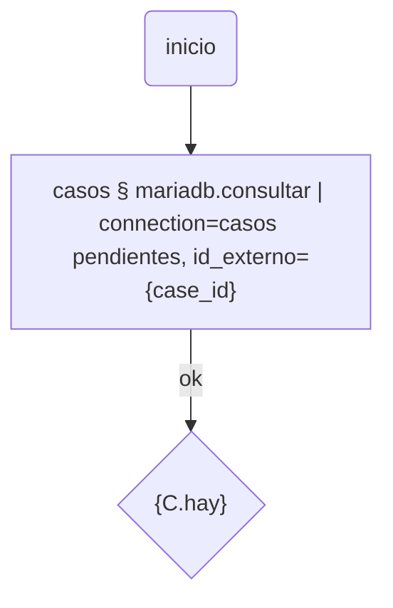

# mariadb

Consultas de sólo lectura, guardadas y reutilizables en un flujo, contra un
servidor **MySQL o MariaDB** externo — segundo plugin de la serie
"connections, pero para SQL" (ver [`sqlite`](../sqlite/README.md), el
primero).

Se instala solo, sin dependencias. Pide el port `socket`
(`workflow-bot-core>=0.3.1-beta.18` — issue #39).

## Por qué no hay un driver adentro

Un plugin nunca importa una librería externa (`pymysql`, `mysqlclient`),
sólo pide ports — y SQL no es un protocolo único como HTTP: cada motor tiene
el suyo. Por eso `workflow-bot-core#39` terminó en un `SocketPort` de
transporte crudo (TCP/TLS, sin nada de protocolo de aplicación), y este
plugin implementa el protocolo cliente/servidor de MySQL **a mano**, en
Python puro, en `protocolo.py` (handshake, auth, framing de paquetes,
parseo de result sets — ver el docstring de ese módulo para el detalle).

MariaDB es un fork de MySQL que mantiene compatibilidad con ese protocolo —
no tiene uno propio — así que un solo plugin cubre los dos motores sin
ramas distintas: el saludo inicial dice cuál es, pero el cliente no
necesita tratarlos diferente.

## Alcance de este MVP (deliberado, igual criterio que el resto del catálogo)

- **Auth**: sólo `mysql_native_password`. Si el servidor pide
  `caching_sha2_password` (default de MySQL 8+) o `ed25519` (MariaDB), el
  error lo dice explícitamente — no hay intento a ciegas.
- **Protocolo de consulta simple** (`COM_QUERY`), no prepared statements.
- **Un result set por consulta**, que entre en un paquete de hasta 16MB.
- Los valores de fila vuelven siempre como **texto** (protocolo de texto):
  un número es el string que mandó el servidor, igual que cualquier cliente
  MySQL antes de que el driver lo tipe.

## La diferencia real con `sqlite`: no hay bind real

SQLite tiene un canal de parámetros de verdad (`?` posicional, resuelto por
el motor). El protocolo simple de MySQL/MariaDB no: todo es texto, no hay
nada parecido a un bind separado del SQL. Por eso un `{variable}` resuelto
acá se **cita y escapa** (`escapar_valor`, mismas reglas que
`mysql_real_escape_string`) antes de pegarlo en el SQL guardado — más débil
que un bind real porque depende de que el escapado cubra los casos, pero
contiene un valor con comillas adentro en vez de dejarlo cambiar qué SQL se
ejecuta. Se probó explícitamente contra un intento de inyección (`x' OR
'1'='1`) antes de este README.

## Resource: Conexiones

| Campo | Qué es |
|---|---|
| Host, Puerto | del servidor (puerto por defecto 3306) |
| Usuario, Contraseña | la Contraseña nunca sale en claro de un listado |
| Base de datos | a la que se conecta |
| SQL | la sentencia; un `{variable}` se cita y resuelve al ejecutar |

## Tool de flujo

**`mariadb.consultar`**: corre una Conexión guardada. `{variable}` en su SQL
se sustituye (citada) primero contra cualquier param extra del propio nodo,
y si no contra el contexto del run.

- `{filas}`: todas, cada una como dict (valores como texto).
- `{primera}`: la primera, para leerla con `{NODO.primera.columna}`.
- `{cantidad}`: cuántas.
- `{hay}`: `'si'`/`'no'`, para un nodo de decisión.

## Actions

- **Probar**: corre la Conexión guardada tal cual (sin resolver
  `{variables}` del SQL) y muestra las filas.
- **Probar** (sin guardar): corre lo que está en el formulario contra
  "Variables para probar", sin guardar nada.

## Validado contra un servidor real

Antes de publicarse, el protocolo completo (handshake, auth
`mysql_native_password`, `COM_QUERY` con filas/columnas/NULL/error, una
contraseña incorrecta rechazada, y un intento de inyección contenido por
`escapar_valor`) se corrió contra una MariaDB 11.4 real, no sólo contra
`FakeSocket`.

## Lo que queda afuera, a propósito

- `caching_sha2_password`/`ed25519`/TLS: no implementados en este MVP — el
  error al conectar lo dice.
- Prepared statements / bind real: ver arriba.
- Postgres es otro plugin — protocolo de cable distinto, sobre el mismo
  port `socket`.
