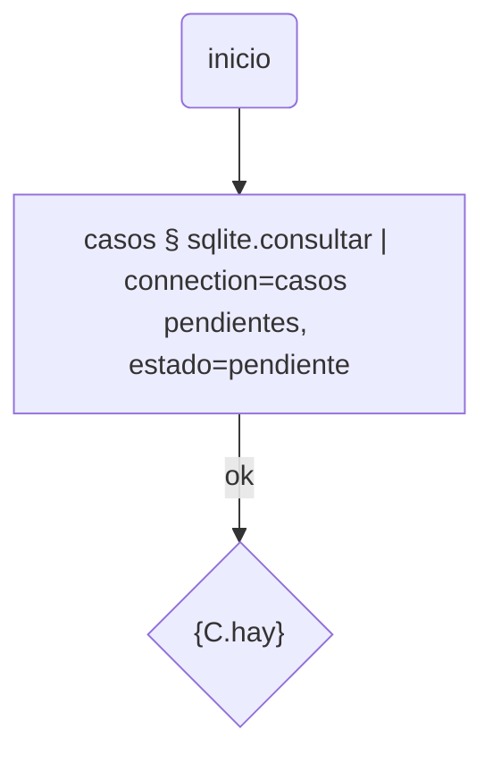

# sqlite

Consultas de sólo lectura, guardadas y reutilizables en un flujo, contra un
archivo SQLite externo — no la base del propio Bot.

Se instala solo, sin dependencias. Pide el port `sqlite_file`
(`workflow-bot-core>=0.3.1-beta.18` o la rama `develop` posterior al
17 de workflow-bot-core#40 — cualquier núcleo anterior no lo tiene).

## De dónde viene

Primer plugin de la serie "connections, pero para SQL" (ver el catálogo
raíz). Se evaluó un port genérico para SQL externo (Postgres, MySQL) y
terminó resuelto en dos partes, en `workflow-bot-core`:

- **`socket`** (#39): TCP/TLS crudo, para cuando el motor habla por red con
  su propio protocolo de cable (Postgres, MySQL) — un plugin futuro tiene que
  implementar ese protocolo a mano sobre `send`/`recv`.
- **`sqlite_file`** (#40): SQLite no habla por red — es un archivo local que
  ya se abre con `sqlite3` de stdlib — así que tiene su propio port, chico y
  sin nada que ver con el de arriba.

Este plugin usa sólo el segundo. Cuando haga falta Postgres o
MySQL/MariaDB, va a ser otro plugin (u otros), sobre `socket`.

## Nunca se interpola el SQL

Una Query guardada tiene su sentencia **fija**, con `?` donde va cada
parámetro posicional (el mismo mecanismo de `sqlite3`/DB-API). Lo único que
puede variar por corrida son los *valores* de la lista `params`: un valor que
sea exactamente `{variable}` se resuelve contra el contexto del run (o un
param extra del nodo) **conservando su tipo** — un id numérico sigue
llegando como número al bind, no como texto. Un placeholder metido adentro de
un string más largo (`"pref_{id}_suf"`) sí se resuelve como texto, porque ahí
sólo puede ir texto.

Es lo que hace que esto no pueda terminar en una inyección SQL: ningún valor
puede cambiar **qué** SQL se ejecuta, sólo **con qué** se lo ejecuta.

## Siempre de sólo lectura

El port abre el archivo en modo `ro` de la URI de `sqlite3` — un
`INSERT`/`UPDATE` falla al nivel del propio motor ("attempt to write a
readonly database"), no por una convención de este plugin que un SQL mal
escrito pudiera esquivar.

## Resource: Queries

| Campo | Qué es |
|---|---|
| Archivo SQLite (`path`) | ruta al `.sqlite`/`.db` externo |
| SQL | la sentencia, con `?` por cada parámetro |
| Parámetros (`params`) | lista de valores para esos `?`, en orden — literales o `{variable}` |

## Tool de flujo

**`sqlite.consultar`**: corre una Query guardada. `{variable}` en sus
`params` se sustituye primero contra cualquier param extra del propio nodo,
y si no contra el contexto del run.

- `{filas}`: todas, cada una como dict.
- `{primera}`: la primera, para leerla con `{NODO.primera.columna}`.
- `{cantidad}`: cuántas.
- `{hay}`: `'si'`/`'no'`, para un nodo de decisión.

La tarjeta del nodo, con una Query elegida, ofrece como params extra
exactamente las `{variables}` que esa Query usa en `params` — no en el SQL,
que nunca se mira para esto.

## Actions

- **Probar**: corre la Query guardada tal cual (sin resolver `{variables}`
  de sus `params`) y muestra las filas.
- **Probar** (sin guardar): corre lo que está en el formulario —`path`,
  `sql`, `params`— contra "Variables para probar", sin guardar nada.

## Lo que queda afuera, a propósito

- No tapa nada en logs/respuestas: no hay secreto que ocultar acá (una ruta
  de archivo no lo es), a diferencia de `connections`.
- No expone `columns(table)` del port todavía — nada lo pidió; cuando haga
  falta inspeccionar esquema desde un flujo, es una Action nueva, no una
  que ya exista con otro nombre.
- Postgres y MySQL/MariaDB quedan para otro plugin, sobre el port `socket`.
